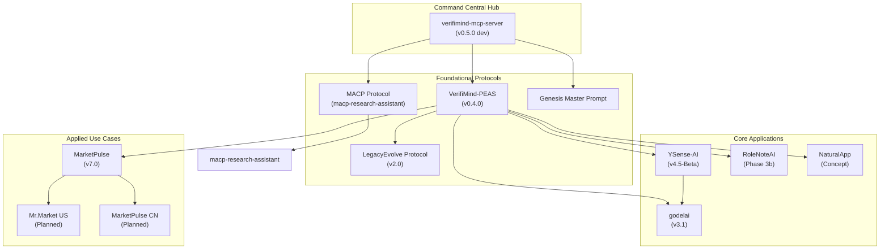

# YSenseAI Ecosystem Map & Unified Roadmap (Feb 2026)

**Author:** Manus AI (CSO R)
**Status:** Strategic Blueprint

---

## 1. Executive Summary

The YSenseAI ecosystem is a constellation of 9+ interconnected projects designed to build a new paradigm for ethical AI, data sovereignty, and human-AI collaboration. This document provides a unified, top-down view of the entire ecosystem, cross-validating all project roadmaps to create a single source of strategic truth. 

The core of the ecosystem is the **VerifiMind-PEAS** methodology, a validation-first framework for building ethical and secure applications. This methodology is operationalized through the **verifimind-mcp-server**, which acts as the **Command Central Hub** for all projects, ensuring consistent validation and governance.

This analysis reveals a highly ambitious and synergistic portfolio, but also highlights critical gaps in documentation and cross-project alignment that need to be addressed to realize the full vision.

---

## 2. YSenseAI Ecosystem Architecture

This diagram illustrates the relationships between the core components of the YSenseAI ecosystem. The **VerifiMind Genesis MCP** sits at the center, acting as the governance and validation engine for all other projects.

---

## 3. Project Deep Dive & Status Audit

This table provides a comprehensive audit of each project, based on the automated analysis of all 9 repositories.

| Project | Version | Status | Key Dependencies | Roadmap Gaps |
| :--- | :--- | :--- | :--- | :--- |
| **verifimind-mcp-server** | v0.2.3 (v0.5.0 dev) | Active Dev | VerifiMind-PEAS, MACP | **No formal roadmap file** |
| **VerifiMind-PEAS** | v0.4.0 | Operational | YSenseAI, MACP | Roadmap exists but needs detail |
| **MarketPulse** | v7.0 | Production | VerifiMind-PEAS | **No formal roadmap file** |
| **godelai** | v3.1 | Active Dev | YSenseAI, VerifiMind-PEAS | Data bottleneck issue |
| **YSense-AI** | v4.5-Beta | Beta | Z-Protocol, VerifiMind-PEAS | High-level roadmap, needs detail |
| **macp-research-assistant** | v1.0 | Active Dev | GODELAI, VerifiMind-PEAS | Roadmap embedded in README |
| **RoleNoteAI** | Phase 3b | Active Dev | VerifiMind-PEAS, Gemma 3 | On-device AI is a major dependency |
| **NaturalApp** | Concept | Concept | VerifiMind-PEAS, On-device SLMs | Purely conceptual at this stage |
| **LegacyEvolve** | v2.0 | Complete | MCP | No future roadmap (maintenance mode) |

---

## 4. Strategic Alignment & Gap Analysis

### Strengths:
*   **Strong Foundation:** The core of the ecosystem (VerifiMind-PEAS, MCP Server, MACP) is well-defined and provides a solid base for all other projects.
*   **High Synergy:** The projects are highly interconnected and create a powerful narrative around ethical AI and data sovereignty.
*   **Validation-First Culture:** The consistent use of VerifiMind-PEAS across all projects is a major strength and a key differentiator.

### Critical Gaps:
1.  **Unified Roadmap:** The biggest gap is the lack of a single, unified roadmap. This makes it difficult to track dependencies and manage the portfolio as a whole.
2.  **Inconsistent Documentation:** Roadmap information is scattered across READMEs, dedicated files, or is missing entirely.
3.  **MACP Adoption:** While defined, the MACP protocol is not yet consistently referenced or integrated across all relevant projects (e.g., MarketPulse).
4.  **Private vs. Public Development:** There's a disconnect between the public-facing repositories and the private development you're doing (e.g., MCP server v0.5.0). This needs to be reconciled.

---

## 5. Proposed Unified Roadmap (2026)

This unified roadmap aligns all projects under the **Command Central Hub** strategy.

### Q1 2026: Foundational Alignment
*   **verifimind-mcp-server (v0.5.0):** Implement **Project Namespace** governance model. **(Owner: Claude Code)**
*   **VerifiMind-PEAS (v0.5.0):** Integrate **Agent Skills** support. **(Owner: Manus AI)**
*   **YSenseAI Ecosystem:** Update all repository READMEs with a link to this unified ecosystem map. **(Owner: Manus AI)**
*   **MarketPulse CN (v6.0):** Begin development using the `marketpulse-cn` project ID on the central hub. **(Owner: Manus AI)**

### Q2 2026: Ecosystem Expansion
*   **Mr.Market US (v1.0):** Begin development of the AI chatbot using the `mrmarket-us` project ID. **(Owner: Manus AI)**
*   **YSense-AI (v5.0):** Implement blockchain integration and smart contracts for revenue distribution. **(Owner: Claude Code)**
*   **godelai (v3.2):** Research and implement solutions for the "conflict data" bottleneck. **(Owner: Claude Code)**
*   **RoleNoteAI (Phase 3c/3d):** Complete the Role Intelligence and AI Chat engines. **(Owner: Claude Code)**

### Q3 2026: Integration & Commercialization
*   **VerifiMind-PEAS (v0.6.0):** Develop the MCP App for easier validation workflows. **(Owner: Manus AI)**
*   **Mr.Market US (v1.1):** Integrate with **InviteMember** for Telegram monetization. **(Owner: Manus AI)**
*   **YSense-AI (v6.0):** Launch the VerifiMind-PEAS API for "attribution as a service". **(Owner: Claude Code)**

### Q4 2026: Maturity & Future Vision
*   **Ecosystem-wide:** Conduct a full review of the unified roadmap and plan for 2027.
*   **MACP (v2.0):** Draft the next version of the MACP specification based on learnings from all projects.

---

## 6. Handoff Artifacts for Claude Code

To execute this unified vision, the following artifacts will be prepared for handoff to Claude Code:

1.  **`YSenseAI_Ecosystem_Map.md` (This Document):** The single source of truth for the ecosystem vision and roadmap.
2.  **`MCP_Server_v0.5.0_Implementation_Guide.md`:** A detailed guide for implementing the "Project Namespace" feature in the MCP server.
3.  **`Unified_Roadmaps/` directory:** A new directory in the `verifimind-genesis-mcp` repo containing individual, standardized roadmap files for each project.

This strategic alignment will ensure that all development efforts are coordinated, dependencies are managed, and the YSenseAI ecosystem evolves into a cohesive and powerful platform.
